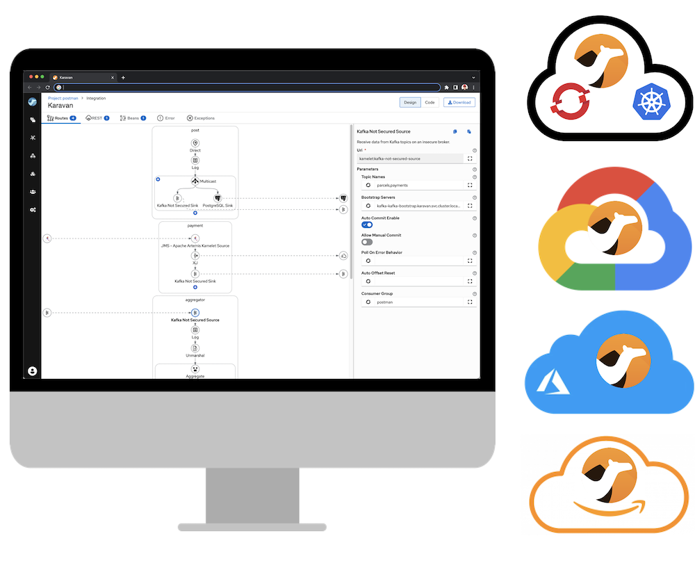
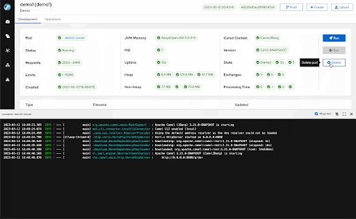

## Apache Camel Karavan 

**Apache Camel Karavan** is a **Low-Code Data Integration Platform** 

It simplifies the Apache Camel experience and accelerates developer performance by visually designing and rapidly deploying integration microservices.

* Full power of Apache Camel through Visual Tool
* From Low-code use-cases to Pro-code projects
* Powered by 10+ years of Community Intelligence

## Features

### Designer

* Enterprise Integration Patterns
* 300+ Integration Components 
* REST API designer with OpenAPI to REST DSL generator
* YAML for Integration and Java custom code

### Deployer
* Simple shell scripts for build and deploy
* Configuration 
* Predefined customizable scripts for different platforms

### Developer Dashboard
* Hot Reload
* View live logs during development
* Tracing Exchange Data 

### Local
Karavan provides VS Code extension for local developer experience
* Design, code and run integrations on your laptop or PC 
* Deploy to Kubernetes or Openshift
* Download from [Marketplace](https://marketplace.visualstudio.com/items?itemName=camel-karavan.karavan) or [Open VSX Registry](https://open-vsx.org/extension/camel-karavan/karavan)

## Documentation

### How to install on
* [Docker](docs/WEB_DOCKER.md)
* [Kubernetes](docs/WEB_KUBERNETES.md)
* [Openshift](docs/WEB_OPENSHIFT.md)

### Developer guide
* [Architecture](docs/ARCHITECTURE.md)
* [How to build](docs/DEV.md)

### Feedback
If you haven't done so yet, please be sure to download Karavan and give it a try. We're excited to receive your feedback and learn about your experiences!

* [Ask questions](https://github.com/apache/camel-karavan/discussions)
* [Open Issues](https://github.com/apache/camel-karavan/issues)

