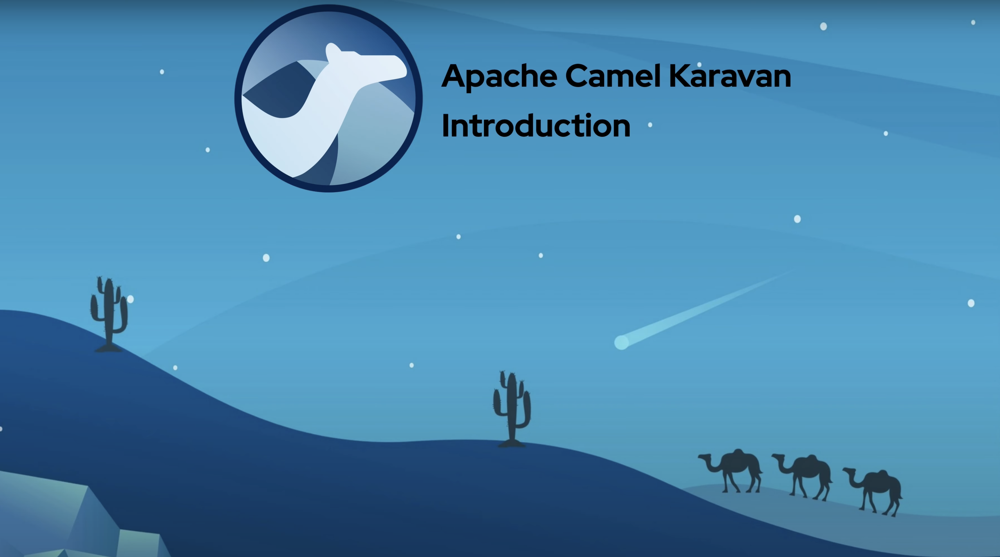

Karavan is an Integration Toolkit for Apache Camel, which makes integration easy and fun through the visualization of pipelines, integration with runtimes and package, image build and deploy to Docker or Kubernetes out-of-the-box.

Integrations could be created using visual designer that includes Enterprise Integration Patterns DSL, REST API and Beans builder, all Camel Kamelets and Components. Karavan uses YAML to read/write integrations. Integrations could be run directly from Karavan or they could be exported in the Maven project with preconfigured Camel Quarkus, Camel Spring-Boot or Camel Main runtime. Integration project output is a runnable uber-jar or an OCI image for local environment or a deployed application to a Docker, Kubernetes or OpenShift in any cloud provider.

## Features
### Visual Designer
* Enterprise Integration Patterns
* REST API designer with OpenAPI to REST DSL generator
* 300+ Components 
* Custom Java code snippets

### All in Git
* Integration routes (YAML, Java)
* Configuration (application.properties, docker-compose.yaml, deployment.yaml, etc)
* Customizable build scripts 

### Target deployment
* [Docker](docs/WEB_DOCKER.md)
* [Kubernetes](docs/WEB_KUBERNETES.md)
* [Openshift](docs/WEB_OPENSHIFT.md)

## Documentation
[Karavan documentation](docs/README.md)
