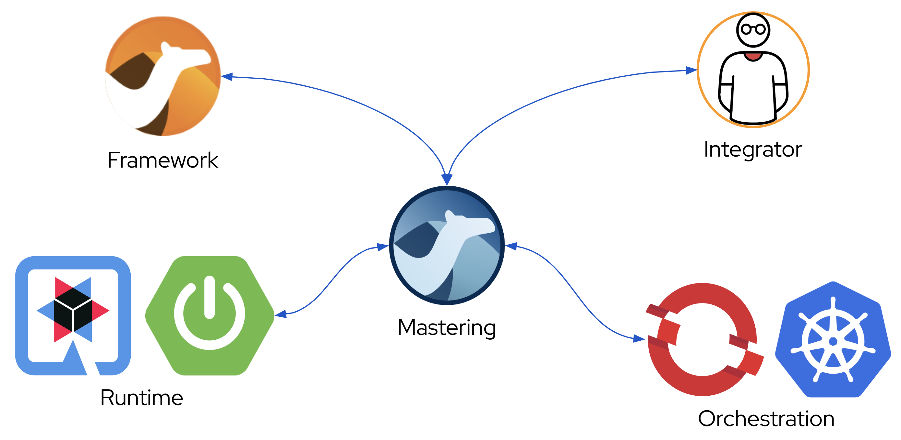
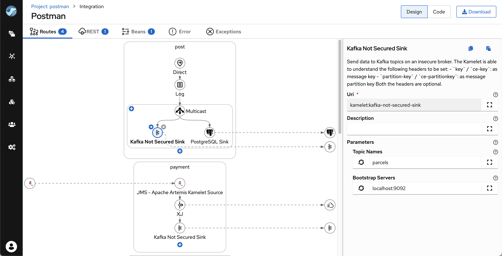
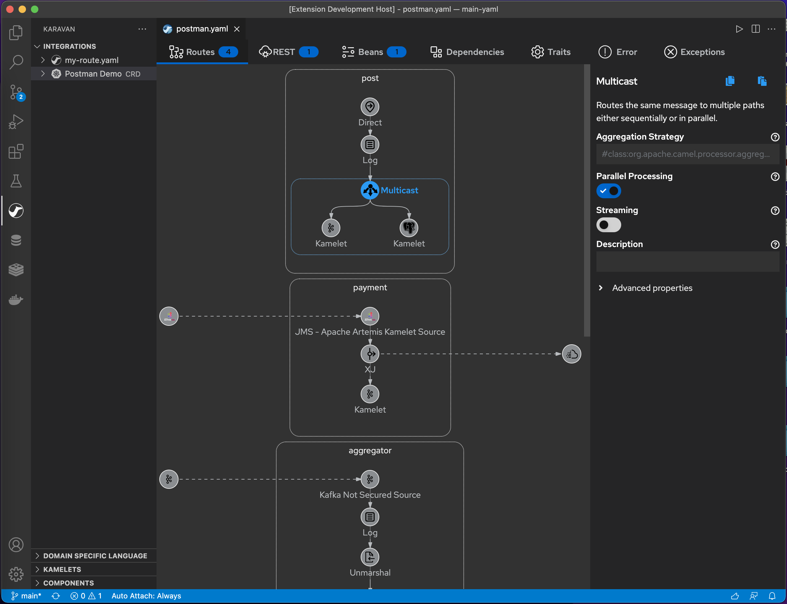

Mastering Tool for Apache Camel makes integration easy and fun through the visualization of pipelines, integration with runtimes and package, image build and deploy to kubernetes out-of-the-box.

## Features
### Mode
* [Self-managed iPaaS](karavan-builder/README.md)
* [VS Code extension](karavan-vscode/README.md)
### Visual Designer for Integrations
* Enterprise Integration Patterns DSL
* REST DSL designer
* OpenAPI to REST DSL generator
* Beans and dependencies
* 100+ Kamelets source/sink/action
* 300+ Components consumer/producer
* Read/Write Integration CRD (*.yaml with kind:Integration) and plain yaml routes
### Runtimes
* [Camel JBang](https://camel.apache.org/manual/camel-jbang.html)
* [Camel Quarkus](https://camel.apache.org/camel-quarkus)
* [Camel Spring-Boot](https://camel.apache.org/camel-spring-boot) (WIP)
* [Camel Main](https://camel.apache.org/components/3.18.x/others/main.html) (WIP)
### Build and Deploy
* Maven for local development
* Tekton Pipelines for Kubernetes/OpenShift
### Documentation
Build-in catalogues:
* Enterprise Integration Patterns
* Kamelets
* Components

## Karavan Self-Managed iPaaS
More about [Karavan Self-Managed iPaaS](karavan-builder/README.md)

## Karavan VS Code extension
Install Karavan VS Code extension from the [Marketplace](https://marketplace.visualstudio.com/items?itemName=camel-karavan.karavan)

More about [Karavan VS Code Extension](karavan-vscode/README.md)

## Development
How to build [Karavan](DEV.md)