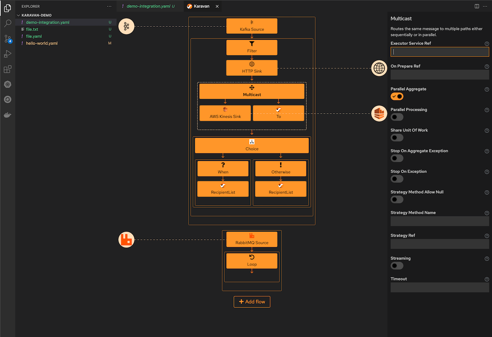
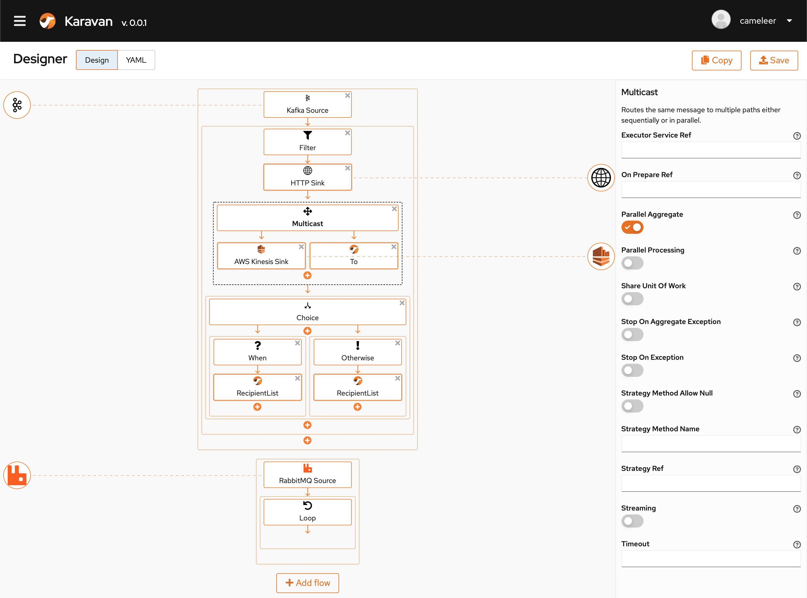

# Karavan
Integration Designer for Apache Camel

### VS Code extension


### Standalone application


## Project structure
1. Karavan-generator  
Generate Camel Models and Api from Camel sources to Typescript in Karavan-designer
2. Karavan-Designer  
KaravanDesigner UI component and simple web app
3. Karavan-vscode  
VS Code extension based on KaravanDesigner
4. Karavan-app  
Karavan Application
5. Karavan-demo  
Demo of Karavan use cases


## How to build
1. Generate Camel Models ad API for Typescript
```
mvn clean compile exec:java -Dexec.mainClass="org.apache.camel.karavan.generator.KaravanGenerator" -f karavan-generator
```

2. Build VS Code extension
```
cd  karavan-vscode
yarn install
yarn run compile // dev
yarn run package //prod
```

3. Build Karavan app  
- Build JVM Mode
```
cd karavan-app
mvn clean package -Dquarkus.container-image.build=true
```
- Build native
```
DOCKER_BUILDKIT=1 docker build -f karavan-app/src/main/docker/Dockerfile.multistage -t apache/camel-karavan .
```

## Development Karavan app
You can run your application in dev mode that enables live coding using:
- Backend
```shell script
cd karavan
mvn compile quarkus:dev
```
- Frontend
```shell script
cd karavan/src/main/webapp/
npm start
```

## Running in local mode
- Run JVM Mode
```shell script
docker run -it -p 8080:8080 -v $(pwd):/deployments/integrations ghcr.io/apache/camel-karavan:latest
```
For SELinux
```shell script
docker run -it -p 8080:8080 -v $(pwd):/deployments/integrations:z ghcr.io/apache/camel-karavan:latest
```

- Run native
```shell script
docker run -it -p 8080:8080 -v $(pwd):/deployments/integrations ghcr.io/apache/camel-karavan-native:latest
```
For SELinux
```shell script
docker run -it -p 8080:8080 -v $(pwd):/deployments/integrations:z ghcr.io/apache/camel-karavan-native:latest
```

## Running in cloud mode
[Karavan demo on OpenShift](karavan-demo/openshift/README.md)
