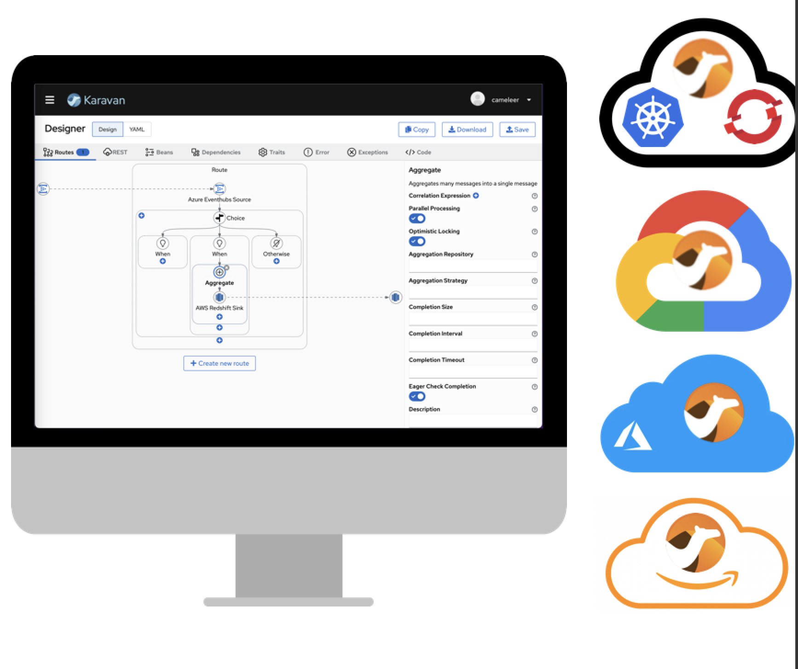

Karavan is an Integration Platform for Apache Camel, which makes integration easy and fun through the visualization of pipelines, integration with runtimes and package, image build and deploy to kubernetes out-of-the-box.

Integrations could be created using visual designer that includes Enterprise Integration Patterns DSL, REST API and Beans builder, all Camel Kamelets and Components. Karavan uses YAML to read/write integrations. Integrations could be run directly from Karavan UI using Camel JBang. Also they could exported in Maven project with preconfigured Camel Quarkus, Camel Spring-Boot or Camel Main runtime. Integration project output is a runnable uber-jar or an OCI image for local environment or a deployed application to a Kubernetes/OpenShift in any cloud provider.

## Introduction

https://user-images.githubusercontent.com/1379213/211049026-4496d054-d529-4917-837f-a59b6f2f84b1.mp4

## Installation

Two types of applications are available: 
1. [Cloud-native](karavan-cloud/README.md) application deployed into Kubernetes/OpenShift 
2. [VS Code extension](karavan-vscode/README.md) available on the [Marketplace](https://marketplace.visualstudio.com/items?itemName=camel-karavan.karavan). Extensions for VS Code Compatible Editors available on [Open VSX Registry](https://open-vsx.org/extension/camel-karavan/karavan)

Both applications share same visual designer and work with Camel YAMl DSL.

## Karavan cloud-native application
Karavan cloud-native integration toolkit is an application to manage projects, design and monitor integrations, Tekton pipeline to build and deploy integrations. More about [cloud-native Karavan](karavan-cloud/README.md)

## Karavan VS Code extension
Install Karavan VS Code extension from the [Marketplace](https://marketplace.visualstudio.com/items?itemName=camel-karavan.karavan) or from [Open VSX Registry](https://open-vsx.org/extension/camel-karavan/karavan)

More about [Karavan VS Code Extension](karavan-vscode/README.md)

## Features
### Mode
* [Cloud-native](karavan-cloud/README.md)
* [VS Code extension](karavan-vscode/README.md)
### Visual Designer for Integrations
* Enterprise Integration Patterns DSL
* REST DSL designer
* OpenAPI to REST DSL generator
* Beans and dependencies
* 100+ Kamelets source/sink/action
* 300+ Components consumer/producer
* Read/Write yaml routes
### Runtimes
* [Camel JBang](https://camel.apache.org/manual/camel-jbang.html)
* [Camel Quarkus](https://camel.apache.org/camel-quarkus)
* [Camel Spring-Boot](https://camel.apache.org/camel-spring-boot)
### Build and Deploy
* Maven for local development
* Tekton Pipelines for Kubernetes/OpenShift
### Documentation
Build-in catalogues:
* Enterprise Integration Patterns
* Kamelets
* Components

## Development
How to build [Karavan](DEV.md)
