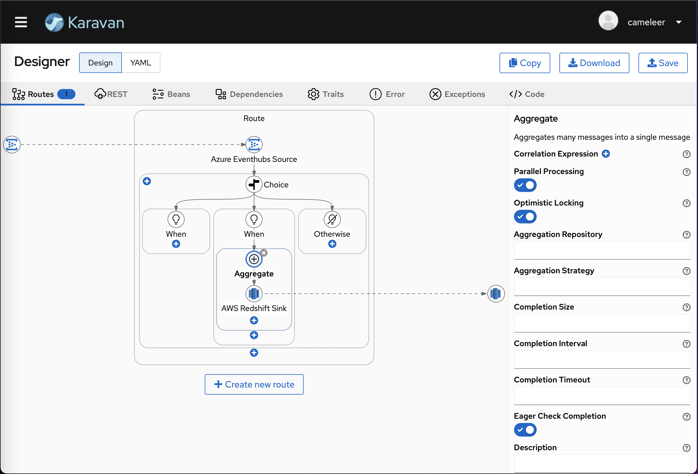

## Apache Camel Karavan
Mastering Tool for Apache Camel makes integration easy and fun through the visualization of pipelines and integration with runtimes.

## Features

* Enterprise Integration Patterns DSL
* REST DSL
* Beans and dependencies
* 100+ Kamelets source/sink/action
* 300+ Components consumer/producer
* Read/Write Integration CRD (*.yaml with kind:Integration) and plain yaml routes
* Integration with [Camel-K](https://camel.apache.org/camel-k/next/index.html) and [JBang](https://www.jbang.dev)

## VS Code extension
Install Karavan VS Code extension from the [Marketplace](https://marketplace.visualstudio.com/items?itemName=camel-karavan.karavan)


## Standalone application

 Install Karavan Standalone command line: `docker pull ghcr.io/apache/camel-karavan:latest`



## Project structure
1. Karavan-generator  
Generate Camel Models and Api from Camel sources to Typescript in Karavan-designer
2. Karavan-Designer  
KaravanDesigner UI component and simple web app
3. Karavan-vscode  
VS Code extension based on KaravanDesigner
4. Karavan-app  
Karavan Application
5. Karavan-demo  
Demo of Karavan use cases


## How to build
1. Generate Camel Models and API for Typescript
```
mvn clean compile exec:java -Dexec.mainClass="org.apache.camel.karavan.generator.KaravanGenerator" -f karavan-generator
```

2. Build VS Code extension
```
cd  karavan-vscode
yarn install
yarn run compile // dev
yarn run package //prod
```

3. Build Karavan app  
- Build JVM Mode
```
cd karavan-app
mvn clean package -Dquarkus.container-image.build=true
```
- Build native
```
DOCKER_BUILDKIT=1 docker build -f karavan-app/src/main/docker/Dockerfile.multistage -t apache/camel-karavan .
```

## Development Karavan app
You can run your application in dev mode that enables live coding using:
- Backend
```shell script
cd karavan-app
mvn quarkus:dev
```
- Frontend
```shell script
cd karavan-app/src/main/webapp/
npm start
```

## Running in local mode
- Run JVM Mode
```shell script
docker run -it -p 8080:8080 -v $(pwd):/deployments/integrations ghcr.io/apache/camel-karavan:latest
```
For SELinux
```shell script
docker run -it -p 8080:8080 -v $(pwd):/deployments/integrations:z ghcr.io/apache/camel-karavan:latest
```

- Run native
```shell script
docker run -it -p 8080:8080 -v $(pwd):/deployments/integrations ghcr.io/apache/camel-karavan-native:latest
```
For SELinux
```shell script
docker run -it -p 8080:8080 -v $(pwd):/deployments/integrations:z ghcr.io/apache/camel-karavan-native:latest
```

## Running in GitOps mode
[Karavan demo on OpenShift](karavan-demo/openshift/README.md)

## Running in Serverless mode
[Karavan demo on Kubernetes](karavan-demo/serverless/README.md)
