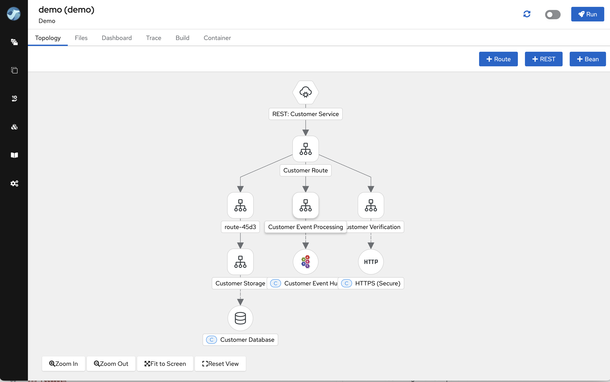
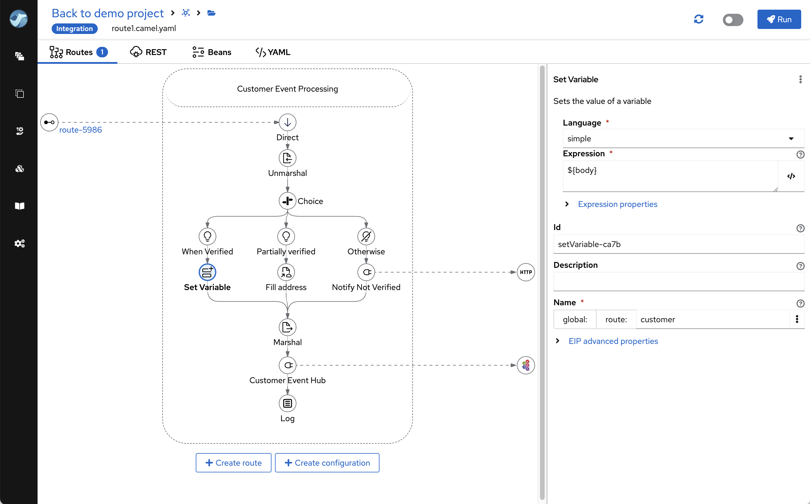
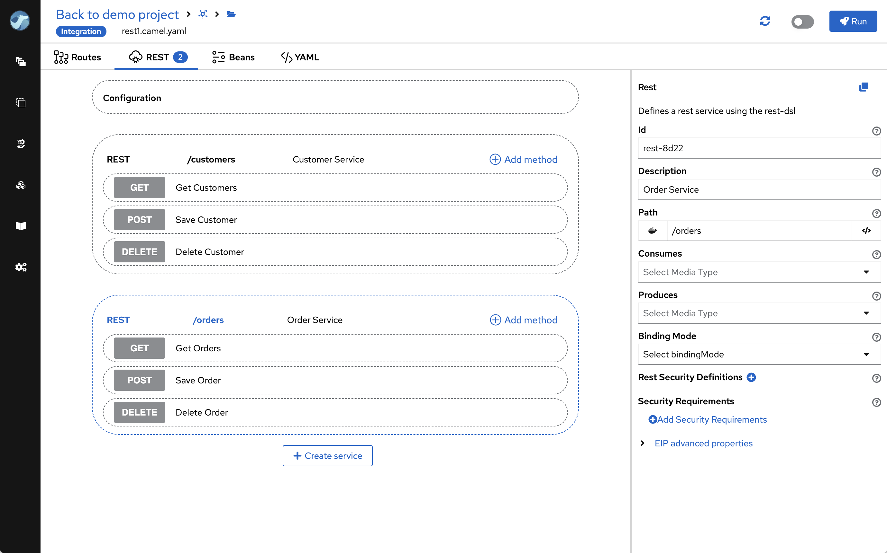
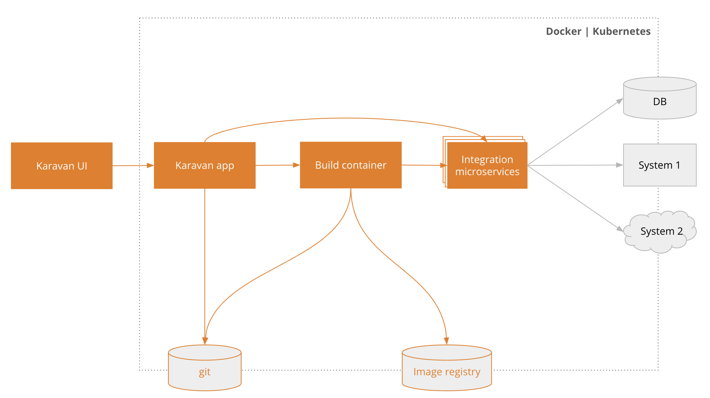

<h1 align="center" style="border-bottom: none">
    Apache Camel Karavan
</h1>

**Apache Camel Karavan** is a **Low-Code Data Integration Platform** 
It simplifies the Apache Camel experience and accelerates developer performance by visually designing and rapidly deploying integration microservices.

* Full power of Apache Camel through Visual Tool
* From Low-code use-cases to Pro-code projects
* Powered by 10+ years of Community Intelligence

  

## Features

### Designer

* Enterprise Integration Patterns
* 300+ Integration Components 
* REST API designer with OpenAPI to REST DSL generator
* YAML for Integration and Java custom code

#### Topology view

  

#### Route designer

  

#### REST API designer

  

### Deployer
* Simple shell scripts for build and deploy
* Configuration 
* Predefined customizable scripts for different platforms

### Developer Dashboard
* Hot Reload
* View live logs during development
* Tracing Exchange Data 

  

## Architecture

Apache Camel Karavan components:

1. **Karavan app** acts as the central interface for the platform, allowing users to manage and orchestrate their integration projects.
2. **Build Container** started by the Karavan app to run integrations in developer mode (dev-mode), package and deploy integrations.
3. **Integration microservices** delivered by the platform.
4. **Git repository** stores all essential project files, including integration YAML configurations, application.properties, container configurations, deployment resources, and templates. It is considered the source of truth for the applications.
5. An **Image Registry** is used by the Apache Camel Karavan to store container images that are generated during the build process.

  

## Local
Karavan provides VS Code extension for local developer experience
* Design, code and run integrations on your laptop or PC 
* Deploy to Kubernetes or Openshift
* Download from [Marketplace](https://marketplace.visualstudio.com/items?itemName=camel-karavan.karavan) or [Open VSX Registry](https://open-vsx.org/extension/camel-karavan/karavan)

## Documentation

### How to install on
* [Docker](docs/WEB_DOCKER.md)
* [Kubernetes](docs/WEB_KUBERNETES.md)
* [Openshift](docs/WEB_OPENSHIFT.md)

### Developer guide
* [How to build](docs/DEV.md)

### Feedback
If you haven't done so yet, please be sure to download Karavan and give it a try. We're excited to receive your feedback and learn about your experiences!

* [Ask questions](https://github.com/apache/camel-karavan/discussions)
* [Open Issues](https://github.com/apache/camel-karavan/issues)

