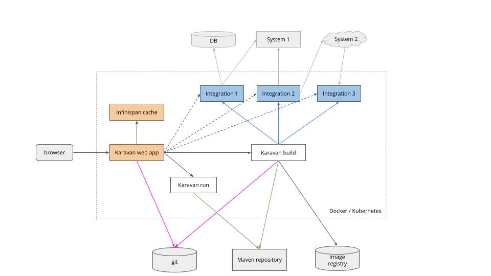

## Apache Camel Karavan Architecture

### Karavan components

#### Web application

End-user application to interact with.

#### Infinispan

Karavan keeps all project files and monitoring data in Infinispan Caches

#### Karavan run

Container created by Karavan application to run project in developer mode.
Container uses `apache/camel-karavan-devmode` image to run.

#### Karavan build

Container created by Karavan application to build and deploy project.
Container uses `apache/camel-karavan-devmode` image to run.

#### Git repository

All Karavan projects and build scripts stored in Git repository.

#### Image Registry

Karavan Build push images to Image registry configured

#### Maven Repository

Karavan run and build use Maven repository to get dependencies.

#### Integrations

Running integration microservices 
