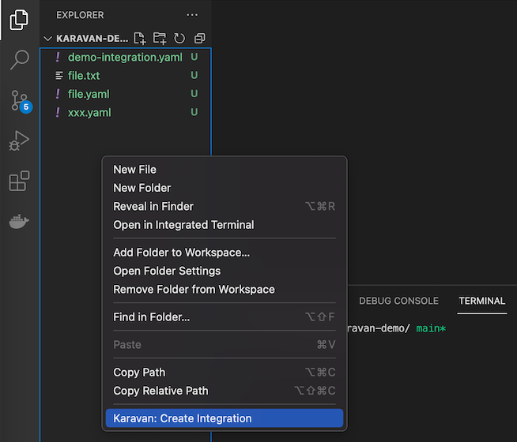
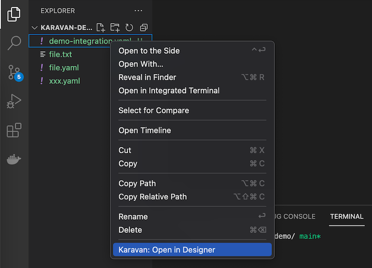

# How to use Karavan 

## Create new Integration



## Edit an existing Integration




## Run integration locally
* Run in UI: click `Run` button 


* Run using CLI
    ```shell
    jbang -Dcamel.jbang.version=4.8.0 camel@apache/camel run $INTEGRATION.yaml --max-messages=10 --logging-level=info
    ```

## Export integration to Maven project

* Export using context menu


* Export using CLI
    ```shell
    jbang -Dcamel.jbang.version=4.8.0 camel@apache/camel export --directory=export
    ```