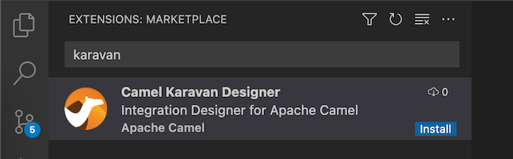

# Install Karavan extension in VS Code

## Prerequisites
* Microsoft VS Code installed. You can get the most recent version from (https://code.visualstudio.com/) for your chosen operating system.
* [Camel JBang] installed(https://camel.apache.org/manual/camel-jbang.html)

## How to install
1. Open your VS Code Integrated Development Environment (IDE).
2. In the VS Code Activity Bar, select Extensions. (Alternatively, press Ctrl+Shift+X).
3. In the search bar, type **Karavan**
4. In the **Apache Camel Karavan** box, click **Install**.

