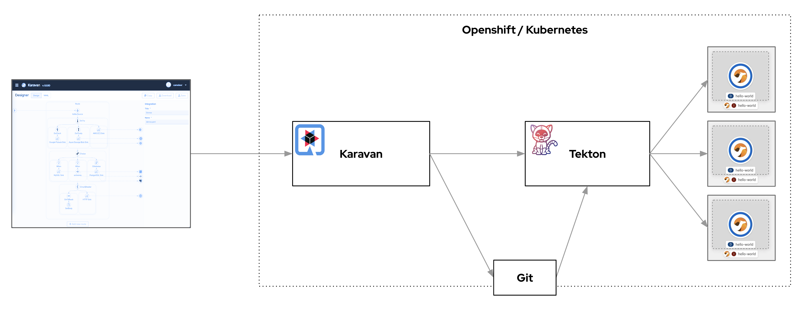

## Karavan Self-Managed iPaaS

### Architecture


### Requirements
1. OpenShift 4.10+ cluster up and running
2. OpenShift 4.10+ CLI installed

### Installation
* Deploy Tekton Operator
    ```
    oc apply -f openshift/pipeline-operator.yaml
    ```
2. Create namespace
    ```
    oc apply -f openshift/karavan-namespace.yaml
    ```
3. Set git parameters
    Edit `karavan-secret.yaml` and set git repository, username and token

4. Deploy karavan
    ```
    oc apply -k openshift
    ```