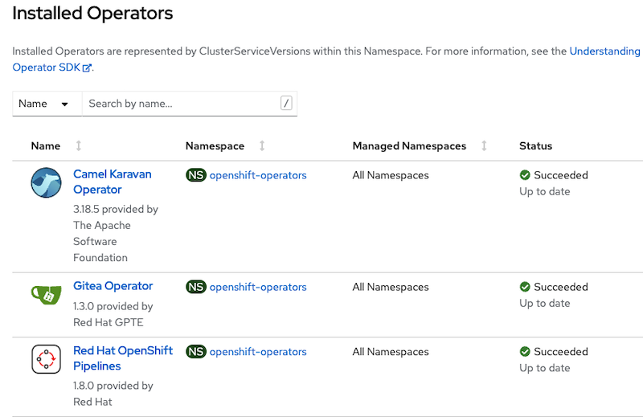
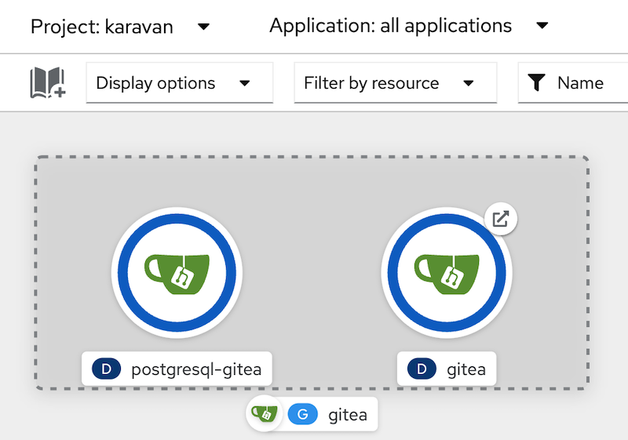

## Karavan demo on OpenShift

Karavan cloud-native integration toolkit demo on OpenShift with Gitea repository

### Requirements
1. OpenShift 4.10+ cluster up and running
2. OpenShift 4.10+ CLI installed

### Installation

#### Install Operators
1. Install the Red Hat GPTE CatalogSource into your cluster (required for Gitea Operator)
    ```
    oc apply -f https://raw.githubusercontent.com/redhat-gpte-devopsautomation/gitea-operator/master/catalog_source.yaml
    ```
2. Install Gitea Operator
    ```
    oc apply -f https://raw.githubusercontent.com/apache/camel-karavan/main/karavan-cloud/openshift/gitea-operator.yaml
    ```
3. Install Tekton Operator if it is not installed yet
    ```
    oc apply -f https://raw.githubusercontent.com/apache/camel-karavan/main/karavan-cloud/openshift/pipeline-operator.yaml
    ```
    
    Wait until operators are ready (Status: Succeeded)
    
4. Install Karavan Operator
    ```
    oc apply -f https://raw.githubusercontent.com/apache/camel-karavan/main/karavan-cloud/openshift/karavan-operator.yaml
    ```
    Wait until operator is ready (Status: Succeeded)

    

#### Install applications
1. Create namespace
    ```
    oc new-project karavan
    ```
    If cluster has LimitRange for karavan namespace, remove LimitRange for the namespace
    
2. Create Gitea instance
    ```
    oc apply -f https://raw.githubusercontent.com/apache/camel-karavan/main/karavan-cloud/openshift/gitea.yaml
    ```

    Wait until Gitea is ready

    

3. Create Karavan Secret
    ```
    oc apply -f https://raw.githubusercontent.com/apache/camel-karavan/main/karavan-cloud/openshift/karavan-secret.yaml
    ```
4. Create Karavan Instance

    ```
    oc apply -f https://raw.githubusercontent.com/apache/camel-karavan/main/karavan-cloud/openshift/karavan.yaml
    ```

    Wait until karavan Karavan is ready and open Karavan
    ```
    open http://karavan-karavan.$(oc get ingresses.config.openshift.io cluster  -o template --template '{{.spec.domain}}') 
    ```
