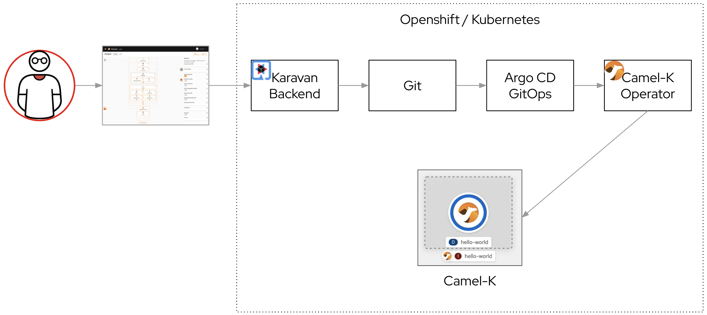

# Karavan GitOps mode demo on Openshift
Required: Openshift 4.7 installed

### Demo
[Video of Karavan demo on Openshift](https://youtu.be/CUCpw1UFLCc)


### Architecture


### Deploy Operators
Deploy GitOps and Camel-K operators
```shell
oc apply -k operators
```
Deploy Apps (ArgoCD, Gitea, Karavan)
```shell
oc apply -k apps
```

### Configure Gitea

- dbuser: `gitea`
- password: `password`
- root password: `password`
- database: `giteadb`
- mysql url: `giteadb:3306`

### Create Gitea user

- username: `git`
- password: `gitgit`

### Create Gitea repository
Create repository with name: `karavan`

### Help
To find the default admin password for Argo CD using the cli, run:

```
oc get secret argocd-cluster \
    -n karavan \
    -o jsonpath='{.data.admin\.password}' | base64 -d
```
