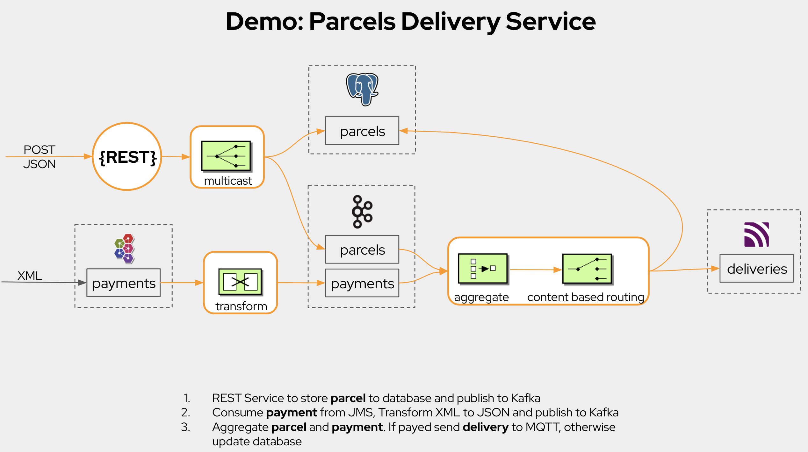
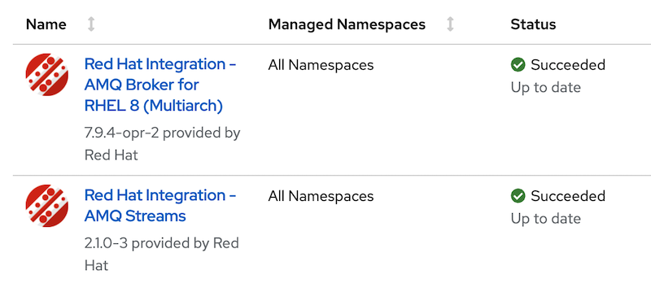
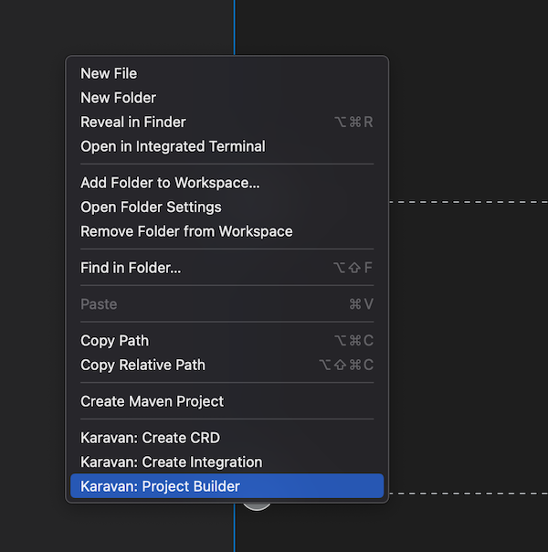

# Demo: Parcels Delivery Service 



## Localhost
### Prerequisites

1. [VSCode](https://code.visualstudio.com/download)  installed
2. Apache Camel [Karavan](https://marketplace.visualstudio.com/items?itemName=camel-karavan.karavan) extension installed
3. [Jbang](https://www.jbang.dev/download/) installed
4. Docker and Docker compose installed
5. Build Apache Artemis Docker Image
```
cd ../artemis
./prepare-docker.sh --from-release --artemis-version 2.22.0
cd _TMP_/artemis/2.22.0
docker build -f ./docker/Dockerfile-adoptopenjdk-11 -t artemis-adoptopenjdk-11 .
cd ../../../../project
```
For MacOS users, in case of `tree command not found` error, install tree `brew install tree`

### Start environment
```
docker-compose up
```

### Start integration 
```
jbang -Dcamel.jbang.version=3.18.0 camel@apache/camel run *
```

### Publish parcel
```
curl -X POST -H "Content-Type: application/json" --data '{"id":"1","address":"666 Sin Street, Holy City"}' http://0.0.0.0:8080/parcels
```

### Publish payment
Open AMQ7 Broker Management [Console](http://localhost:8161)

Send message to `payments` queue
```
<?xml version="1.0" encoding="UTF-8" ?>
<root>
  <id>1</id>
  <amount>777</amount>
  <status>confirmed</status>  
</root>
```

## OpenShift
## Prerequisites

1. [VSCode](https://code.visualstudio.com/download)  installed
2. Apache Camel [Karavan](https://marketplace.visualstudio.com/items?itemName=camel-karavan.karavan) extension installed
3. [Jbang](https://www.jbang.dev/download/) installed
4. OpenShift 4.9+ cluster up and running
4. OpenShift 4.9+ CLI installed


### Install AMQ and AMQ Streams Operators
Also creates `karavan` namespace required for the demo
```
cd ../openshift-manifests
oc login --token=... --server=...
oc apply -k operators
```
Check that operators are succesfully installed


### Create AMQ, Kafka and Postgres demo instances 
```
oc apply -k instances -n karavan
```

### Package, build and deploy project
1. Open Project builder


2. Configure Project and click Start

```

```

### Publish parcel
```
appsurl=$(oc get ingresses.config.openshift.io cluster  -o template --template '{{.spec.domain}}')

curl -X POST -H "Content-Type: application/json" --data '{"id":"1","address":"666 Sin Street, Holy City"}' http://postman-karavan.$appsurl/parcels
```
### Publish payment
Open AMQ7 Broker Management 
```
open http://console-postman.$appsurl
```

Send message to `payments` queue
```
<?xml version="1.0" encoding="UTF-8" ?>
<root>
  <id>1</id>
  <amount>777</amount>
  <status>confirmed</status>  
</root>
```

### Check postman logs and Database
