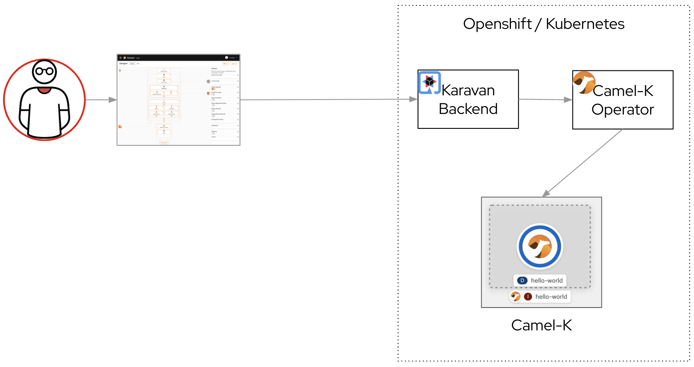

# Karavan Serverless Mode demo on Kubernetes
Required: Minukube v1.24.0 installed

### Demo
[Video of Karavan Serverless Mode demo on Kubernetes](https://youtu.be/m8BCqwHWHCo)

### Architecture


### Install Camel-K
See the Apache Camel K installation page for details: (https://camel.apache.org/camel-k/next/installation/installation.html).

```shell
minikube start
minikube addons enable registry
minikube start --addons registry
kamel install
```

### Install Karavan
```shell
kubectl apply -k karavan -n default
```

### Open Karavan
Get Karavan URL
```shell
minikube service karavan --url
```
Result should be like
```shell
🏃  Starting tunnel for service camel-karavan.
|-----------|---------------|-------------|------------------------|
| NAMESPACE |     NAME      | TARGET PORT |          URL           |
|-----------|---------------|-------------|------------------------|
| default   | camel-karavan |             | http://127.0.0.1:60708 |
|-----------|---------------|-------------|------------------------|
```
Open url `http://127.0.0.1:60708` in browser
