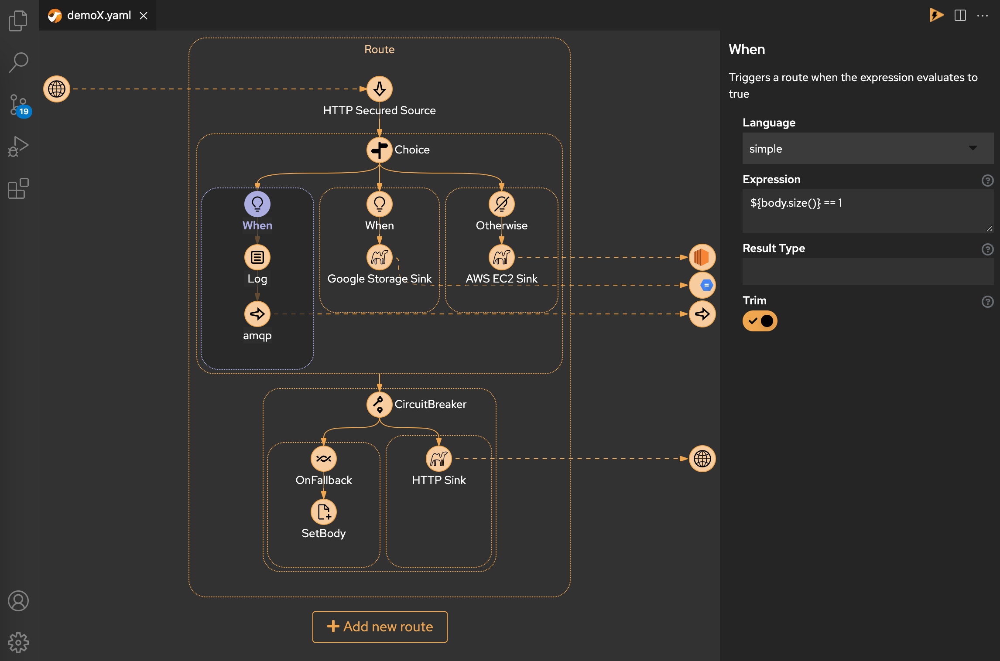
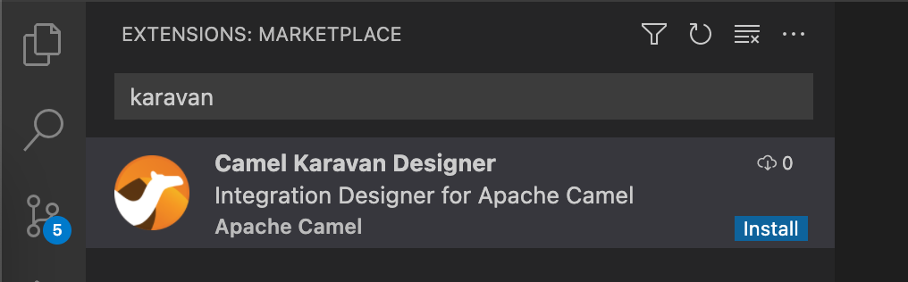
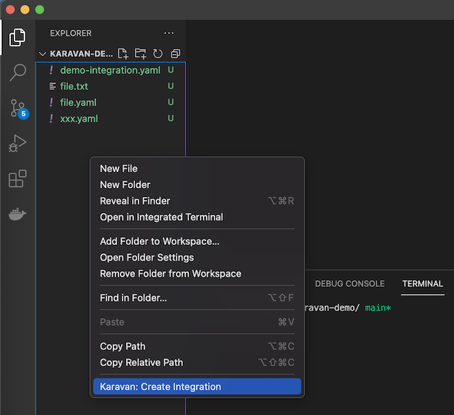
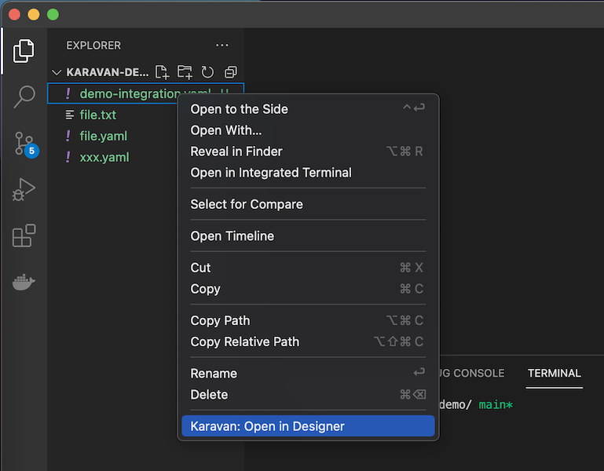

# Integration Designer for Apache Camel


**Integration Designer for Apache Camel** makes integration easy and fun through visualization of integration pipeline.



## Features

* Read/Write Integration resources (*.yaml with kind:Integration)
* Kamelets source/sink/action
* Enterprise Integration Patterns DSL (partial)
* Components consumer/producer (experimental)

## Prerequisites

* Apache Camel K installed. See the Apache Camel K installation page for details: (https://camel.apache.org/camel-k/latest/installation/installation.html).
* Openshift or Kubernetes CLI
* Microsoft VS Code installed. You can get the most recent version from (https://code.visualstudio.com/) for your chosen operating system.

## How to install

1. Open your VS Code Integrated Development Environment (IDE).
2. In the VS Code Activity Bar, select Extensions. (Alternately, press Ctrl+Shift+X).
3. In the search bar, type **Karavan**
4. In the **Apache Camel Karavan** box, click **Install**.



## How to 

### Create new Integration



### Edit an existing Integration



### Deploy

```shell
oc apply -f integration.yaml
```

## Issues

If you find a new issue, please [create a new issue report in GitHub](https://github.com/apache/camel-karavan/issues)!
