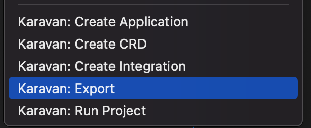

## Apache Camel Karavan
Karavan is an Integration Toolkit for Apache Camel, which makes integration easy and fun through the visualization of pipelines, integration with runtimes and package, image build and deploy to kubernetes out-of-the-box.


Integrations could be created using visual designer that includes Enterprise Integration Patterns DSL, REST API and Beans builder, all Camel Kamelets and Components. 

Karavan uses YAML (Integration CRD or plain) to read/write integrations.

Integrations could be run directly from Karavan UI using Camel JBang. Also they could exported in Maven project with preconfigured Camel Quarkus, Camel Spring-Boot or Camel Main runtime.

Integration project output is a runnable uber-jar or an OCI image for local environment or a deployed application to a Kubernetes/OpenShift in any cloud provider.


## Features
### Visual Designer for Integrations
* Enterprise Integration Patterns DSL
* REST DSL designer
* OpenAPI to REST DSL generator
* Beans and dependencies
* 100+ Kamelets source/sink/action
* 300+ Components consumer/producer
* Read/Write Integration CRD (*.yaml with kind:Integration) and plain yaml routes
### Runtimes
* [Camel JBang](https://camel.apache.org/manual/camel-jbang.html)
* [Camel Quarkus](https://camel.apache.org/camel-quarkus)
* [Camel Spring-Boot](https://camel.apache.org/camel-spring-boot)
* [Camel Main](https://camel.apache.org/components/3.18.x/others/main.html) (WIP)
### Build and Deploy
* Maven for local development
* Tekton Pipelines for Kubernetes/OpenShift
### Documentation
Build-in catalogues:
* Enterprise Integration Patterns
* Kamelets
* Components


# Installation

## Prerequisites
* Microsoft VS Code installed. You can get the most recent version from (https://code.visualstudio.com/) for your chosen operating system.
* [Camel JBang] installed(https://camel.apache.org/manual/camel-jbang.html)

## How to install
1. Open your VS Code Integrated Development Environment (IDE).
2. In the VS Code Activity Bar, select Extensions. (Alternatively, press Ctrl+Shift+X).
3. In the search bar, type **Karavan**
4. In the **Apache Camel Karavan** box, click **Install**.


# Create and edit integration 

## Create new Integration


## Edit an existing Integration


# Run integration

## Run integration locally
* Run in UI: click `Run` button 


* Run using CLI
    ```shell
    jbang -Dcamel.jbang.version=4.8.0 camel@apache/camel run $INTEGRATION.yaml --max-messages=10 --logging-level=info
    ```

## Export integration to Maven project

* Export using context menu


* Export using CLI
    ```shell
    jbang -Dcamel.jbang.version=4.8.0 camel@apache/camel export --directory=export
    ```

# Issues

If you find a new issue, please [create a new issue report in GitHub](https://github.com/apache/camel-karavan/issues)!
